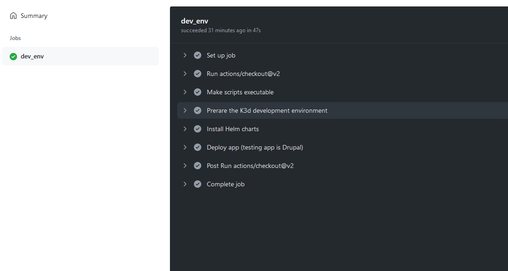

# How to run GitHub Actions workflows locally?


At the time of writing the most preferred method is [nektos/act](https://github.com/nektos/act)  
Act is a great tool but it is not perfect, not yet.  
Bear in mind, there is strong possibility you will plan to migrate from GitHub Actions
to something new in the next 24/36 months.

What you need is to avoid a vendor lock-in by using the vendor-specific tools/language they provide.
The goal is to run the same configuration locally and in GitHub Actions with zero changes and been able to migrate on another tool of choice in the future without re-writing everything.

**Do this:** 
**Not this:** 

## Run GitHub Actions workflows locally

Create a k3d environment:  
```act -r``` will deploy the cluster the first time.  
The next time you run ```act -r``` your cluster will update.


## Install

> You must have docker installed.

1) Install act: <https://github.com/nektos/act#installation>

2) Fork or git clone the repo:  
    ```git clone https://github.com/J0hn-B/k3d_act.git```  

3) ```cd k3d_act```  

4) ```act -r```  deploy for first time

5) From your editor go to .github/workflows/k3d_runner.yml and uncomment **Install Helm charts** action.  

6) ```act -r```  update the cluster

7) Push to your repo and check the actions tab.


